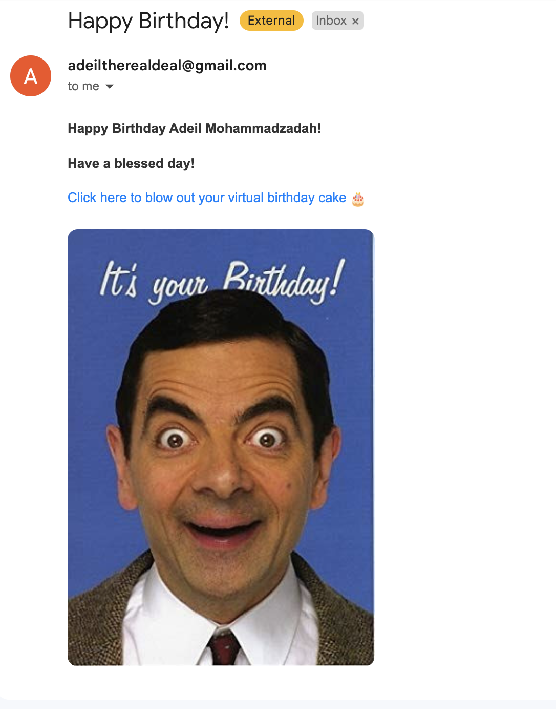

## Project Overview

I created Birthday Bot because I often forget the birthdays of my friends and family. To solve this, I wrote a Python script that sends personalized emails on their birthdays.  

Originally, I wanted the program to send text messages, but after research, I realized that email was more practical and within my knowledge scope. Using the `smtplib` module in Python, I was able to send emails securely through my Gmail account.

---

## How It Works

1. **Birthday List**:  
   I store all birthdays, names, and email addresses in a CSV file for easy access and parsing.  

2. **Sending Personalized Emails**:  
   The script checks the current date and compares it to birthdays in the file. If a match is found, an email is sent with a personalized message, including their name and a fun Mr. Bean birthday image. I also included a link that users can click on to blow out candles on an interactive birthday cake. 

3. **Automation with GitHub Actions**:  
   Initially, I used a cron job, but I discovered it only works when my laptop is turned on. To fully automate the process, I set up GitHub Actions to run the script daily, ensuring the emails are sent even when my laptop is offline.

---

## Challenges and Learnings

### Challenges
- Setting up secure email automation using Gmail with app passwords.  
- Automating the script reliably so it runs every day without manual intervention.  
- Debugging issues related to SMTP email configuration.

### Learnings
This project was a rewarding experience that taught me:  
- How to automate tasks using **GitHub Actions**.  
- How to securely send emails in Python using `smtplib`.  
- The importance of automating processes to make them reliable and efficient.  

---

## Outcome

The final result is a fully automated bot that:  
- Sends a personalized email to my friends and family on their birthdays.  
- Runs daily using GitHub Actions for complete automation.  
- Includes a fun and cheerful birthday message with an interactive birthday cake. 

---

## Links

- **Birthday Bot Repository**: [GitHub Repository](https://github.com/Adeilmo226/BirthdayBot/tree/main)  
- **Interactive Birthday Cake**: [Interactive Birthday Cake](https://adeilmo226.github.io/interactive-birthday-cake/)

