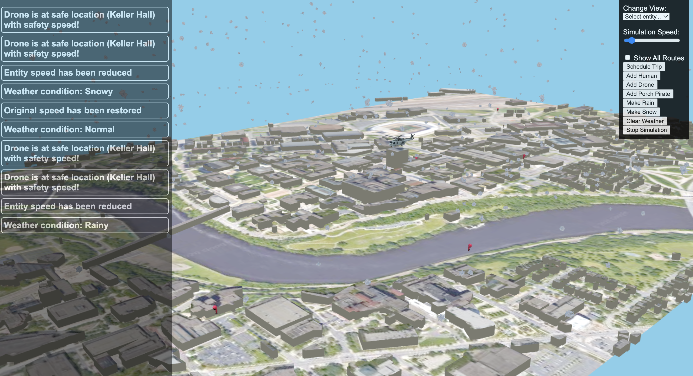

## Project Overview

This project is a detailed simulation of the University of Minnesota campus, incorporating a dynamic drone package delivery system. Users interact with the simulation by choosing two points on the campus map: one for picking up a package and the other for delivery. The simulation allows for multiple path-planning strategies, creating more realistic delivery scenarios.

In addition to drones, the simulation includes other interactive entities like human figures walking the campus and a helicopter flying overhead. These elements add to the complexity and engagement of the environment. Over the course of the semester in **CSCI 3081W: Program Design and Development**, new features were introduced weekly, demonstrating various software development concepts such as design patterns, UI enhancements, and backend optimizations.

### Final Project Extensions
1. **Weather System**: Dynamic weather effects that influence the behavior of simulation entities.  
2. **Porch Pirate Scenario**: Competitive gameplay element where porch pirates race to steal packages before delivery robots can retrieve them.  

---

## Local Setup

make -j

make run    # Default port is 8081

 
## Docker Setup

**Run the container:**

docker run --rm -it -p 8083:8083 adeilmo226/3081_finalproject

**Build the image:**

docker build -t adeilmo226/3081_finalproject

---

## Features of the Simulation

The simulation recreates various challenges and operational scenarios in a virtual campus setting. It models the movement and interaction of several entities, including drones, humans, robots, porch pirates, and even weather-based elements like clouds. Each entity follows a unique behavior pattern, simulating real-world interactions and challenges. This provides a solid framework for experimenting with algorithms and design patterns in a realistic setting.

### Key Entities
- **Drones**: Execute package deliveries by flying between user-defined pickup and drop-off locations.  
- **Humans & Helicopters**: Add movement and activity to the simulation, enriching the campus atmosphere.  
- **Robots & Porch Pirates**: Compete to retrieve packages, adding a security-based gameplay element.  
- **Weather Elements**: Affect the behavior and speed of all moving entities in the simulation.  

---

## <u>Porch Pirate Extension</u>

### What does it do?
The porch pirate extension simulates a race between a robot and roaming porch pirates to retrieve a package. The robot starts at Keller Hall and navigates toward the package using the A* algorithm, while porch pirates wander the map randomly. If a porch pirate reaches the package first, it is considered stolen, and both the package and robot are removed from the simulation.

### Why is it interesting and useful in real life?
This extension models the real-world issue of package theft, commonly known as "porch pirating." It provides insight into how delivery systems can combat theft through automation and robotics. The simulation can help:  
- Test strategies for securing deliveries.  
- Study the effectiveness of delivery robots in real-world conditions where package theft is a concern.  

### How does it enhance the base simulation?
The porch pirate extension introduces unpredictability by adding competitive entities (the porch pirates). This adds complexity and realism to the delivery system, making the simulation more relevant for studying automated deliveries and security systems.

### Design Patterns Used
- **Observer Pattern**:  
  - **Robot**: Notified when the package is dropped off, prompting it to begin its journey.  
  - **Porch Pirates**: Notified when they come within proximity of the package, simulating how a thief would only act upon seeing the package in real life. This pattern ensures flexibility and allows for easy updates or additions to the system.  

### Instructions to Use
1. **Start the Simulation**: Load the simulation to automatically spawn 5 porch pirates.  
2. **Schedule a Delivery**: Use the UI to schedule a package drop-off by a drone.  
3. **Observe the Interaction**: Watch as the robot and pirates compete to retrieve the package.  
4. **Add More Pirates**: Use the "Add Porch Pirates" button to increase the number of pirates.  
5. **Receive Outcome Notifications**: Notifications indicate if the package was secured or stolen, allowing you to schedule a new delivery.  

---

## <u>Weather Extension</u>

### What does it do?
The weather extension controls dynamic weather conditions—rain, snow, and sunshine—which affect the speed of every entity in the simulation. Drones, robots, and even porch pirates will adjust their speeds based on the current weather conditions.

### Why is it interesting and useful in real life?
This feature simulates the real-world impact of weather on delivery systems. It provides valuable insight into how different environmental factors can affect automated systems, such as delivery drones or robots, and helps test their resilience in various conditions.

### How does it enhance the base simulation?
The weather extension adds another layer of complexity by simulating how weather affects entity behavior. It makes the simulation more realistic for testing delivery systems under different environmental conditions, relevant to automated delivery research.

### Design Patterns Used
- **Singleton Pattern**:  
  The Singleton Pattern is employed in the weather extension to manage weather conditions across the simulation. It ensures that only one instance of the weather controller exists, allowing centralized management of weather effects. This reduces code complexity and ensures consistent weather conditions across the entire simulation.

### Instructions to Use
1. **Start the Simulation**: Load the simulation, which defaults to clear weather.  
2. **Change Weather Conditions**: Use the buttons to start "Rain" or "Snow," which will slow down the speed of entities (to 70% for rain and 50% for snow).  
3. **Observe the Effects**: The speed of all entities, including drones and porch pirates, will be adjusted based on the weather.  
4. **Reset Weather**: Use the "Clear Weather" button to return to default sunny conditions.  

---

## **Additional Links**

- [View Docker Image](https://hub.docker.com/repository/docker/adeilmo226/3081_finalproject/general)  
